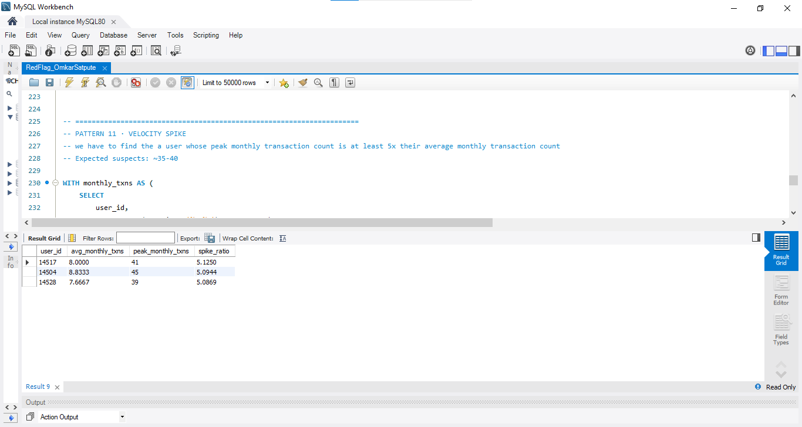

#  RedFlag — Fraud Detection Engine

## 📌 Project Description

RedFlag is a pure SQL fraud detection project built to identify suspicious transaction patterns in a simulated Indian payment aggregator. The dataset contains **200,000 transactions** covering six months of activity, and the objective is to detect **12 different fraud patterns** using SQL without Python, Machine Learning, or fintech APIs. The project applies SQL techniques such as `GROUP BY`, `HAVING`, `CASE WHEN`, subqueries, CTEs, and window functions to identify suspicious users and merchants.

## 🔍 Fraud Patterns Detected

1. **Velocity Fraud** — 30+ transactions by a user in a single day
2. **Round-Amount Clustering** — 15+ transactions using suspicious round amounts
3. **Card Testing** — 30+ transactions under ₹10 in a single day
4. **Failed-Then-Succeeded** — repeated failed transaction behaviour
5. **Odd-Hour Concentration** — 80%+ activity between 2 AM and 4 AM
6. **Mule Accounts** — suspicious credit-to-debit transaction behaviour
7. **Refund Abuse** — 20+ transactions with a refund ratio above 40%
8. **Merchant Collusion** — top 5 users contributing more than 60% of merchant volume
9. **Just-Under-Threshold Structuring** — repeated ₹9,999 transactions
10. **Dormant-Then-Active** — 90+ day inactivity followed by a burst of transactions
11. **Velocity Spike** — peak monthly activity at least 5× the user's average
12. **Geographic Impossibility** — transactions in different cities within 60 minutes

## 🛠️ Tech Stack

* **Database:** MySQL
* **Language:** SQL
* **Techniques:** `GROUP BY`, `HAVING`, `WHERE`, `CASE WHEN`, `IN`, subqueries, correlated subqueries, CTEs, `ROW_NUMBER()`, `LAG()`, `TIMESTAMPDIFF()`, `DATE_FORMAT()`

## 📊 Project Screenshot


Example:



## 📁 Project Structure

```text
RedFlag/
│
├── README.md
├── RedFlag_OmkarSatpute.sql
└── screenshots/
    ├── p8_merchant_collusion.png
    ├── p11_velocity_spike.png
    └── p6_mule-account.png
```

## 🎯 Project Objective

The objective of RedFlag is to demonstrate how SQL can be used to detect real-world fraud patterns in a fintech-style transaction dataset without relying on Machine Learning or Python.

## 📈 Dataset

* **Transactions:** 200,000
* **Time period:** January–June 2024
* **Users:** Approximately 14,700
* **Merchants:** 800
* **Payment modes:** UPI, CARD, NETBANKING, WALLET
* **Transaction types:** DEBIT, CREDIT, REFUND

The dataset is provided as part of the Unlox Academy project and is not included in this repository because of its large file size.

## 👨‍💻 Author

**Omkar Satpute**

Built as part of the **Unlox Academy Industry-Graded Minor Project — RedFlag**.
